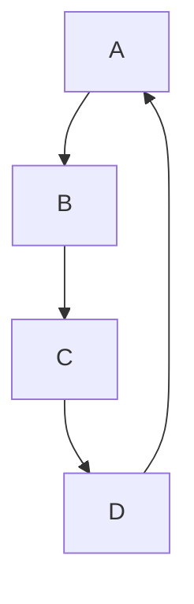

# Hellou

## Testausta 1

Täältä löytyy tekstiä

> Lainausta

Koodin lainausta: `<?php echo "Hello World!" ?>`

Listausta:
- **Boldattu**
- *Italic*
- ~~Strikethrough~~

## Testausta 2 :+1:

Flow chart:

